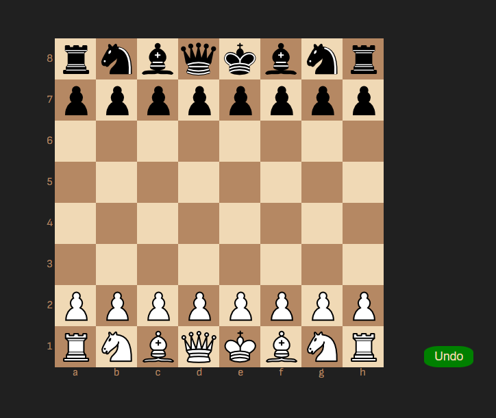
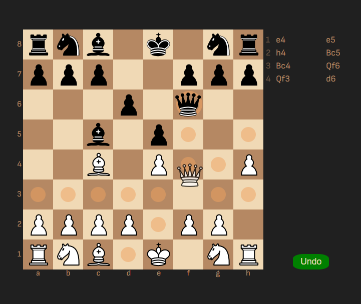
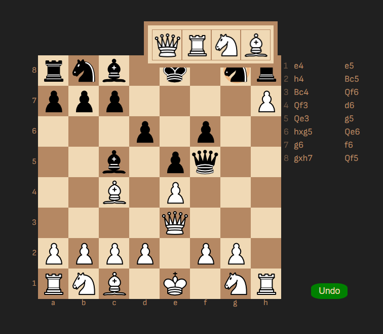
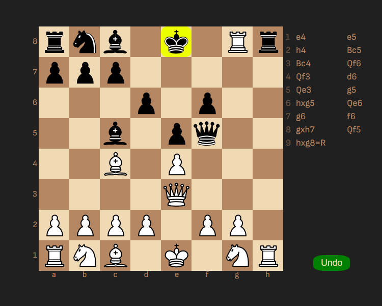
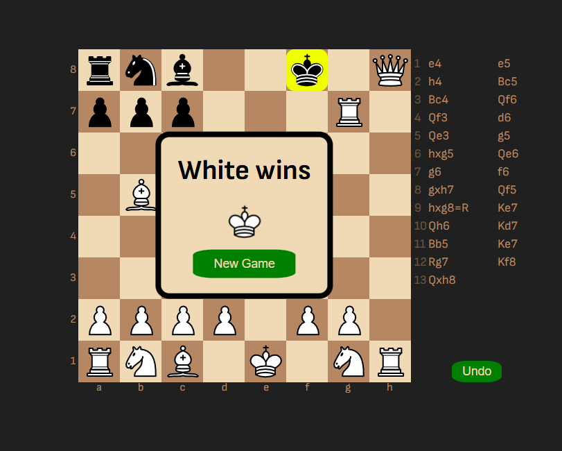
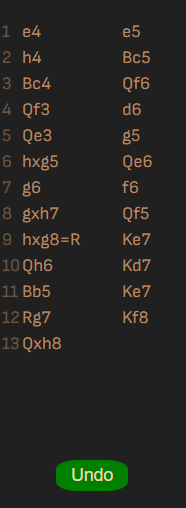

♟️ Chess Game – React Application

A fully functional chess game built using React.js, implementing complete chess rules with an interactive and responsive user interface. This project focuses on clean state management, accurate game logic, and smooth user interactions.

🚀 Core Features

1. Full chess gameplay with legal move validation
2. Check, checkmate, and stalemate detection
3. Castling and pawn promotion
4. Turn-based play with move restrictions
5. Highlighted possible moves
6. Undo move functionality
7. Move history tracking
8. Responsive and intuitive UI

🛠️ Tech Stack

1. React.js
2. JavaScript (ES6+)
3. CSS3
4. React Hooks (useState, useReducer, useContext)

🧠 Key Concepts Implemented

1. Centralized game state using reducers
2. Separation of UI and game logic
3. Immutable state updates for move history
4. Custom helper functions for chess rules
5. Component-driven architecture for scalability

📁 Project Structure

src/
1. ├── components/ # UI components (Board, Square, Promotion, etc.)
2. ├── context/ # Global game state and reducer
3. ├── helpers/ # Chess logic and move generation
4. ├── constants/ # Game statuses and enums
5. ├── App.js
6. └── index.js

▶️ Getting Started

1. Clone the repository
   git clone https://github.com/hammad2412/Chess-Game.git

2. Install dependencies
   
   npm install

3. Run the application
   
   npm start

The app will run on http://localhost:3000

🎯 Learning Outcomes

1. Deep understanding of complex state management
2. Implementing real-world game logic in frontend
3. Handling edge cases and rule-based UI updates
4. Writing scalable and maintainable React code

📸 Screenshots

👨‍💻 Author

Mohd Hammad Khan

Frontend Developer | React.js | JavaScript

GitHub: https://github.com/hammad2412

LinkedIn: https://linkedin.com/in/hammadkhan1224
