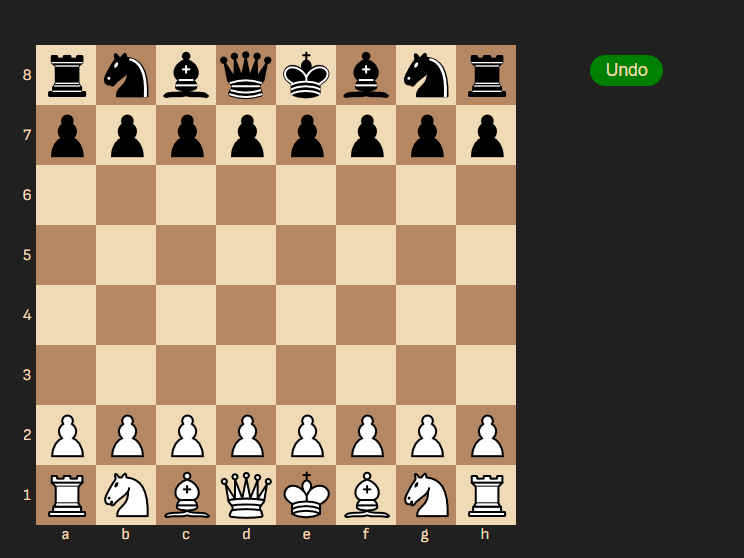
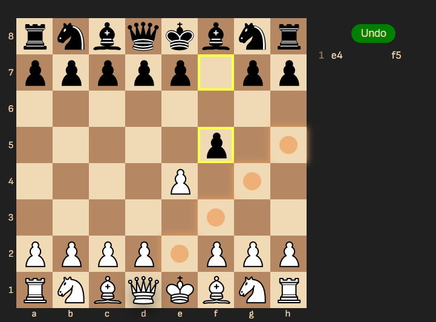
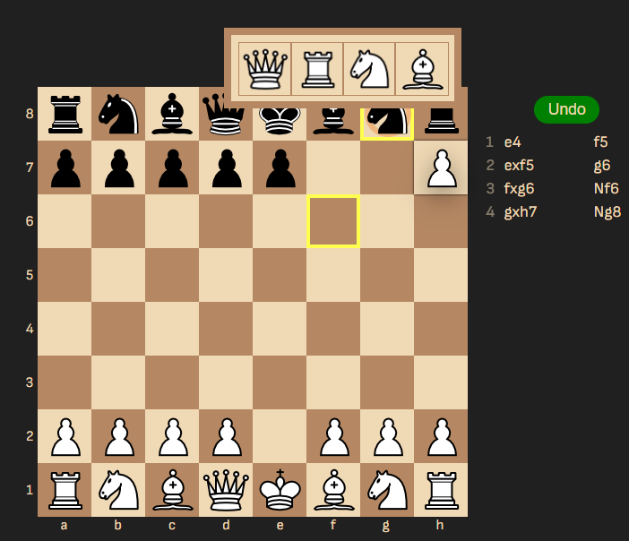
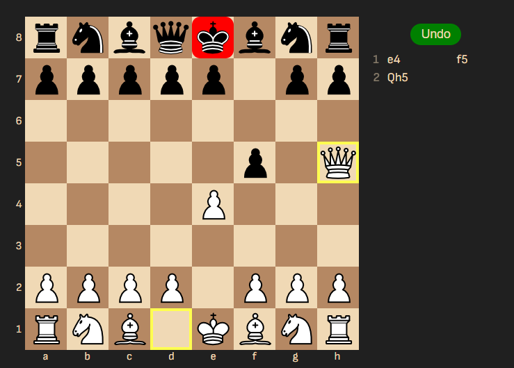
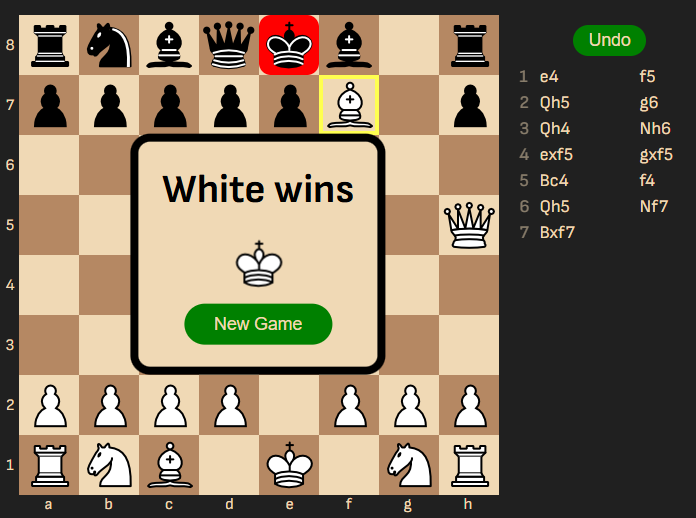
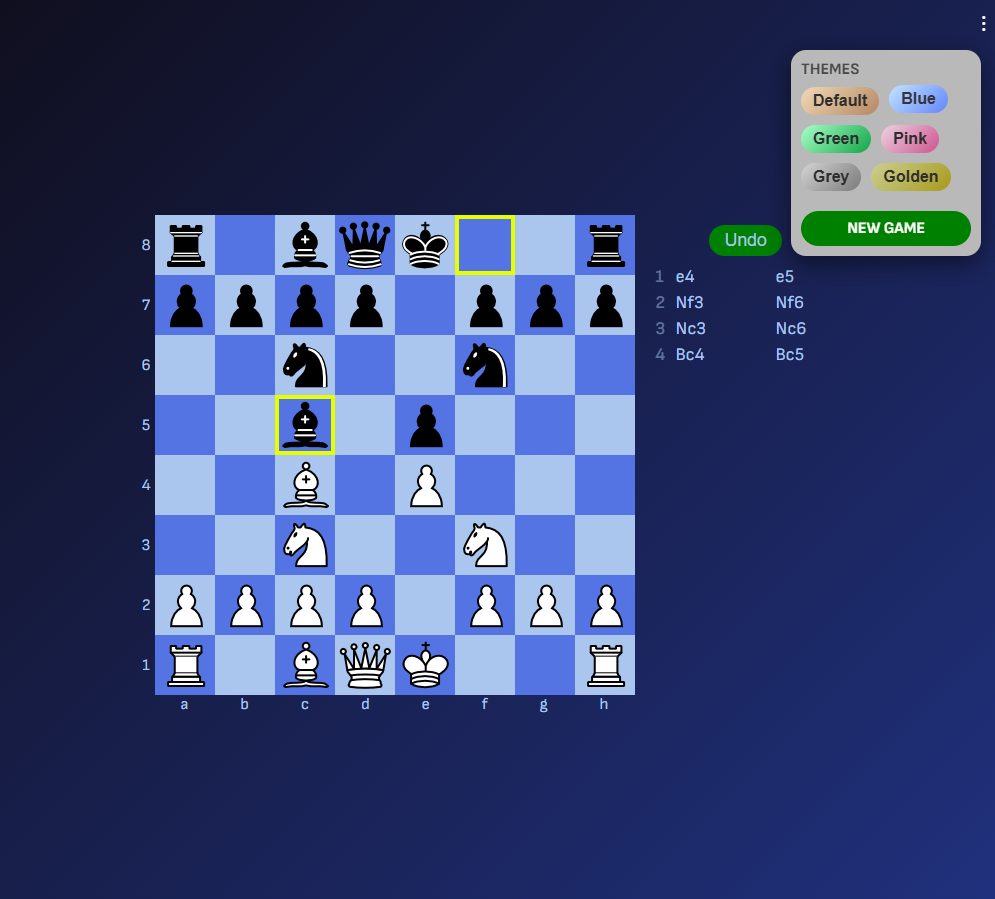
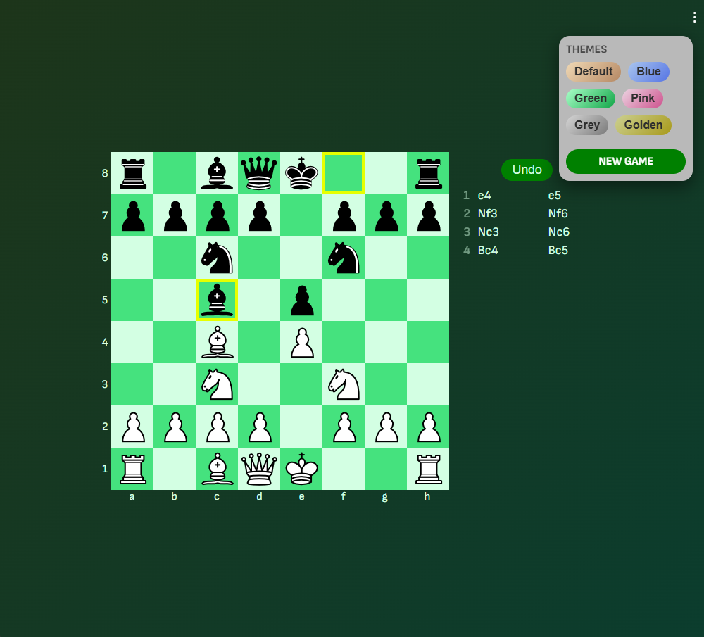
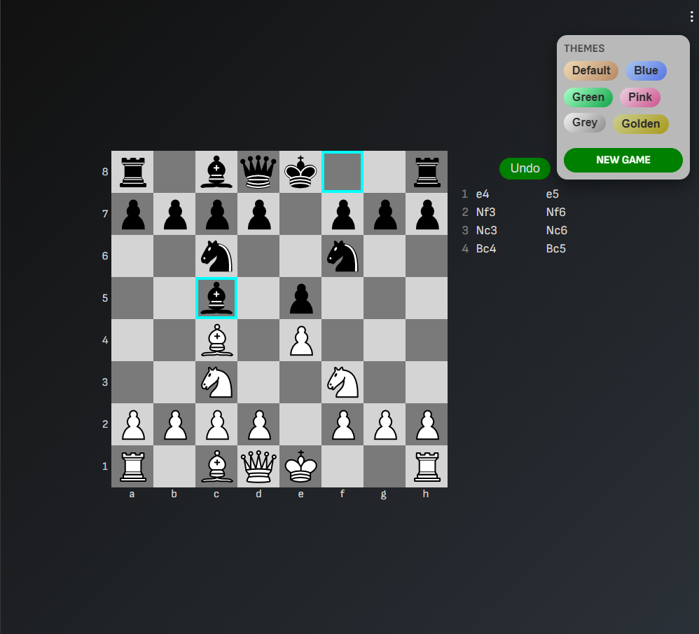
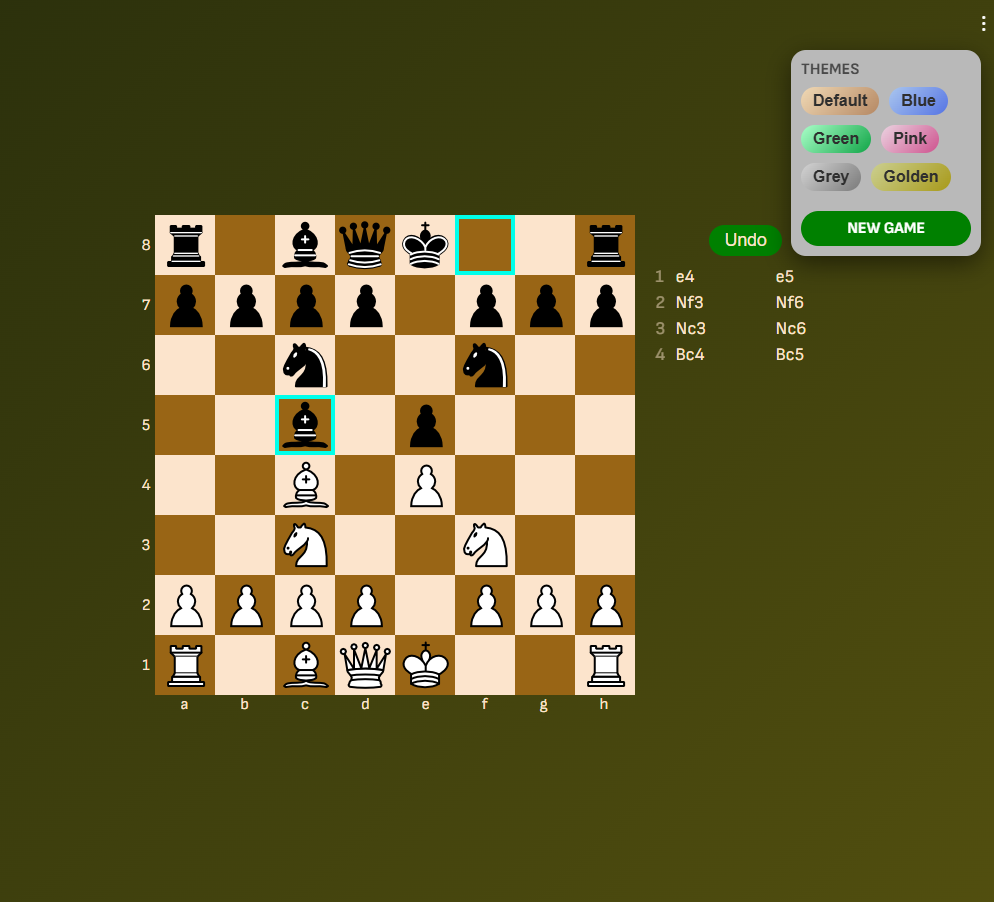
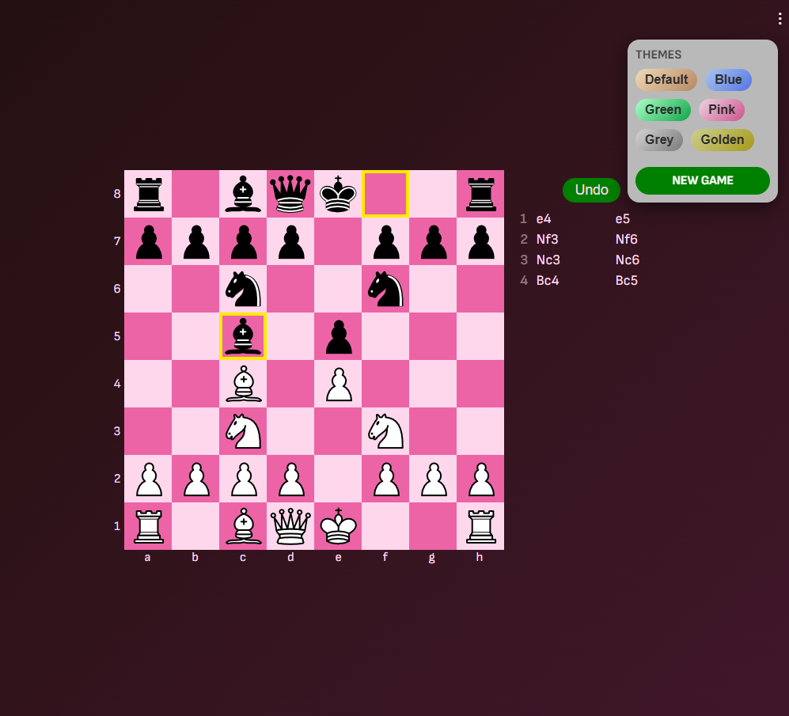

<h1 align="center">♟️ Chess Game</h1>

  A modern, interactive chess game built with React  

 🌐 Live Demo : 
<a href="https://hammad2412.github.io/Chess-Game/" target="_blank">🔗Click here to play the game</a>

---

<h2>📌 About The Project</h2>

A fully functional chess game built using React.js, implementing complete chess rules with an interactive and responsive user interface. This project focuses on clean state management, accurate game logic, and smooth user interactions.

<h2>🚀 Core Features</h2>
<ul>
  <li>✔️ Fully functional chess board</li>
  <li>✔️ Valid move detection</li>
<li>✔️ Check, Checkmate and Stalemate detection</li>
  <li>✔️ Turn-based gameplay (White vs Black) with move restriction</li>
  <li>✔️ Highlighted possible moves with Last move highlight</li>
  <li>✔️ Capture animations</li>
  <li>✔️ Piece shadow on selection</li>
  <li>✔️ Undo move functionality</li>
  <li>✔️ Move history panel</li>
  <li>✔️ Multiple color themes</li>
  <li>✔️ Responsive UI</li>
</ul>

---

<h2>🛠️ Tech Stack</h2>
<ul>
  <li>⚛️ React.js</li>
  <li>🎨 CSS3</li>
  <li>📦 JavaScript (ES6)</li>
  <li>🧩 React Hooks (useContext, useState, useRef, useReducer)</li>
</ul>

---

<h2>🧠 Key Concepts Implemented</h2>
<ul>
<li> Centralized game state using reducers </li>
<li> Separation of UI and game logic </li>
<li> Immutable state updates for move history </li>
<li> Custom helper functions for chess rules</li>
<li> Component-driven architecture for scalability</li>
<ul>

---

<h2>📂 Project Structure</h2>

<pre>
Chess-Game/
│
src/
1. ├── components/ # UI components (Board, Square, Promotion, etc.)
2. ├── context/ # Global game state and reducer
3. ├── helpers/ # Chess logic and move generation
4. ├── constants/ # Game statuses and enums
5. ├── App.js
6. └── index.js
</pre>

---

<h2>⚙️ Run locally</h2>

<pre>

git clone https://github.com/hammad2412/Chess-Game.git

cd Chess-Game

npm install

npm start
</pre>

---

<h2>🎮 How to Play</h2>
<ul>
   <li>Click on a piece or Drag a pieace to see valid moves</li>
   <li>Click or Drop on a highlighted square to move</li>
   <li>Captured pieces disappear with animation</li>
   <li>Use "Undo" button to undo moves</li>
   <li>New Game (Open menu at three dots at top-right carner)</li>
</ul>

---

<h2>📸 Screenshots</h2>

<h4>Board and Gameplay</h4>

<h4>Legal move highlight</h4>

<h4>Pawn promotion</h4>

<h4>Check Detection</h4>

<h4>Checkmate popup (Gameover)</h4>

📷 THEMES

<h4>Blue</h4>

<h4>Green</h4>

<h4>Grey</h4>

<h4>Golden</h4>

<h4>Pink</h4>

---

<h2>🎯 Learning Outcomes</h2>

<ul>
<li>Deep understanding of complex state management</li>
<li> Implementing real-world game logic in frontend</li>
<li> Handling edge cases and rule-based UI updates</li>
<li> Writing scalable and maintainable React code</li>
</ul>

---

<h2>✨ Future Improvements</h2>
<ul>
  <li>AI opponent</li>
  <li>Online multiplayer</li>
  <li>Timer support</li>
  <li>Sound effects</li>
</ul>

---

<h2>👨‍💻 Author</h2>

<strong>Mohd Hammad Khan</strong> 
Frontend Developer | React | JS

<h3>🔗 Connect with me</h3>

<a href="https://www.linkedin.com/in/hammadkhan1224" target="_blank">
  
  LinkedIn 
</a>

<a href="https://github.com/hammad2412" target="_blank">
     
  GitHub
</a>

  ⭐ If you like this project, don’t forget to star the repo!

